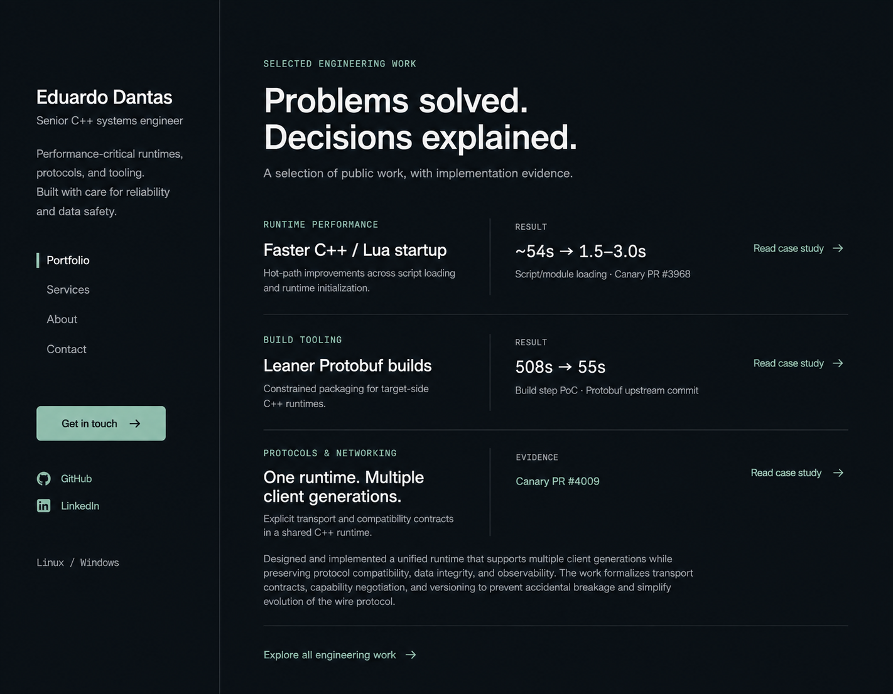
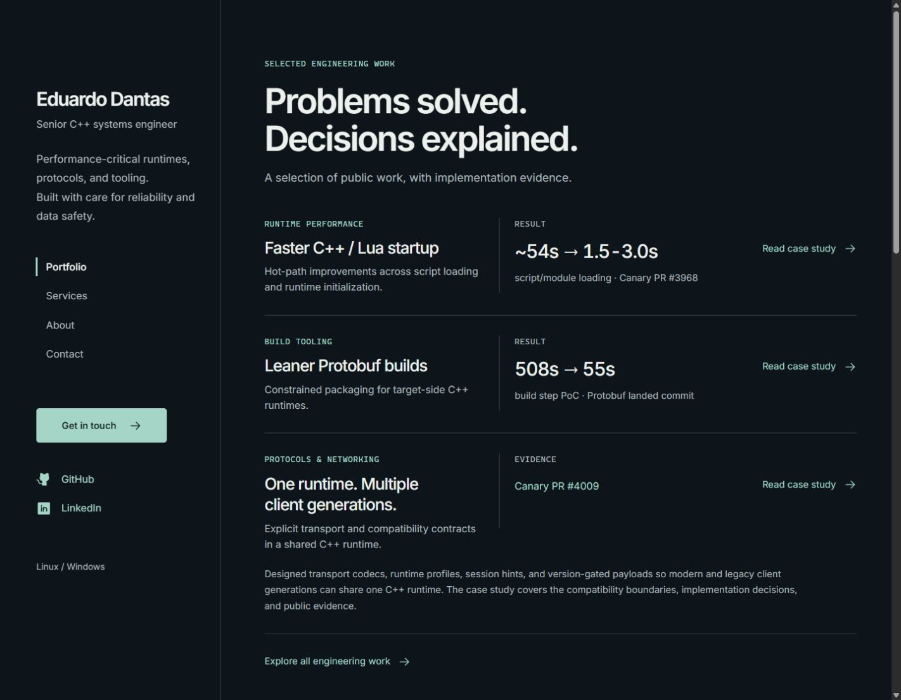

# Systems Index design QA

## Result

No actionable P0, P1, or P2 findings remain in the reviewed states. The selected second direction is implemented across the existing four routes. Review and validation were local only; no publishing was performed.

## Comparison target and capture normalization

- Source visual truth: [selected direction](docs/design/selected-direction.png), the user-selected second design option, 1422 × 1106 pixels. This is a raster design reference without an original CSS viewport or font specification.
- Implementation: the built Astro portfolio at route `/`, dark theme, top of page, all disclosures closed, native scrollbar visible.
- Initial and revised CSS viewport: 1422 × 1106, device pixel ratio 1. The integrated browser exported these captures as 1407 × 1094 JPEGs, approximately 0.9894 output pixels per CSS pixel.
- The final pixel-normalized comparison uses a 1437 × 1118 CSS viewport at device pixel ratio 1, yielding a verified 1422 × 1106 JPEG. This compensates for the browser capture scaling without editing or stretching either image. The slight CSS viewport adjustment is a capture normalization, not a breakpoint or design change.
- Final implementation screenshot: [normalized desktop](docs/design/home-desktop-normalized.jpg). The [1422 CSS-pixel desktop capture](docs/design/home-desktop.jpg) is also retained.
- Mobile captures: 390 × 844 CSS pixels at device pixel ratio 1, exported as 375 × 812 JPEGs. These are responsive usability checks, not comparisons to a separate mobile mock.

## Full-view comparison evidence

The source and implementation were opened together in the same comparison input at each review. The final comparison opened both equal-pixel artifacts together at original resolution. It confirmed the left rail, two-line headline, three work rows, result/evidence columns, quiet separators, and single contact emphasis.

Source:

Final implementation:

Additional cropped comparisons were unnecessary: headings, body copy, navigation, result labels, icons, and CTAs were readable at the original 1422 × 1106 resolution. Responsive controls and expanded content were reviewed separately in the browser.

## Findings and iteration history

1. Initial comparison — blocked, [initial capture](docs/design/home-desktop-initial.jpg).
   - [P2] Sidebar rhythm: the contact button was narrower than the reference and the platform label was anchored near the viewport bottom. This weakened the intended alignment. Fixed with a 13rem button minimum width and an explicit gap after social links.
   - [P2] Work index density: the rows started too low, secondary text was undersized, and the third title wrapped differently. Fixed by reducing the header gap and proof-column height, increasing summary text, and balancing title wrapping.
2. First revised comparison — blocked.
   - [P2] The larger sidebar introduction wrapped to five lines, shifting navigation and contact controls downward. Removed the extra width restriction while retaining two sentence groups.
   - [P2] The main content ended too far from the right edge. Adjusted right padding independently, tightened headline line height, and reduced work-title spacing.
   - The intermediate capture was superseded. Post-fix evidence is retained in the revised and normalized final captures linked above.
3. Revised and normalized comparisons — passed.
   - The source and revised capture were compared together again, followed by the equal-pixel comparison. Earlier sidebar and work-row findings are resolved. The contact emphasis, divider rhythm, three-work hierarchy, and two-line primary headline follow the selected direction.
   - Responsive review also removed the body's minimum width so a 320px viewport respects the native scrollbar. The built page then reported a 305px content width and 305px scroll width, with no clipped text or controls.

## Required fidelity surfaces

| Surface | Review and outcome |
| --- | --- |
| Fonts and typography | Locally bundled Inter Variable provides the reference's compact sans-serif character; native monospace labels retain the technical hierarchy. Headline size, weight, line height, letter spacing, result figures, paragraph wrapping, and secondary text were reviewed. Narrow-screen wrapping is intentional; no truncation was found. |
| Spacing and layout | The desktop rail remains approximately 350px; content aligns around the reference's main left edge. Work rows use separators rather than cards. Contact and service grids collapse at smaller widths. Open disclosures, the mobile menu, and the short desktop rail remain usable. |
| Colors and tokens | Charcoal `#0d151a`, primary text `#edf1ee`, secondary text `#adb8bd`, seafoam `#a5d6c5`, and divider `#344047` reproduce the quiet palette. Calculated text/background contrast is 16.17:1 for primary text, 9.10:1 for secondary text, 11.43:1 for links, and 10.52:1 for the primary button. These checks are not a full accessibility certification. |
| Image quality and assets | The design is typography-led and needs no raster artwork in the page. Icons use bundled Phosphor library assets, not custom drawings. The mock's incidental texture is represented by a flat charcoal surface. The library's GitHub silhouette differs slightly from the reference's circular treatment; this is accepted P3 polish, not a missing asset. |
| Copy and content | The selected headline, short work summaries, navigation, and CTAs are preserved. Existing data owns the technical note, evidence labels, metric provenance, PoC qualification, and case-study content. Generated prose is not used to invent implementation or outcome claims. |

## Route and state evidence

| Route/state | Desktop | Mobile |
| --- | --- | --- |
| Portfolio | [Desktop](docs/design/home-desktop.jpg) | [Mobile](docs/design/home-mobile.jpg) |
| Services | [Desktop](docs/design/services-desktop.jpg) | [Mobile](docs/design/services-mobile.jpg) |
| About | [Desktop](docs/design/about-desktop.jpg) | [Mobile](docs/design/about-mobile.jpg) |
| Contact | [Desktop](docs/design/contact-desktop.jpg) | [Mobile](docs/design/contact-mobile.jpg) |

Additional evidence: [expanded service](docs/design/service-expanded-mobile.jpg), [mobile menu](docs/design/mobile-menu.jpg), and [1024px Contact layout](docs/design/contact-tablet.jpg).

The selected mock specifies only the portfolio's desktop view. Other routes, lower-page sections, and responsive states extend its layout language; they are not claimed as pixel clones of unavailable mocks.

## Validation performed

- `npm run build`: zero errors, warnings, or hints; all four static routes generated.
- Local HTTP checks: `/`, `/services`, `/about`, and `/contact` each returned 200.
- Static generated-output checks: 70 internal links resolve to existing routes and fragment IDs; one H1 and English document language per route; removed layout classes and restricted identifiers are absent.
- Responsive checks: all four routes at 320, 390, 768, 1024, and desktop widths. Inspected visible content and document geometry; no horizontal overflow, overlapping text, or unstable work rows remained in the reviewed states.
- Navigation: active page state, desktop links, mobile route change, Escape returning focus to the menu, outside-click dismissal, keyboard-visible skip link, and skip-link destination.
- Content interaction: case-study opening, reopening the same fragment, all eight case studies, direct service fragments, service expansion and keyboard collapse, contribution expansion exposing all eleven entries, and the contact briefing anchor.
- External links: existing targets and link attributes were preserved. No new external evidence URLs were introduced by the redesign. This pass does not replace the repository's unauthenticated evidence verification gate before a future publication.
- Browser console: final error query returned an empty result.
- Privacy and portability: no additional private references, client identifiers, confidential artifacts, legal company identifiers, or machine-local paths were added to site copy. Company copy remains limited to contracting and invoicing. Documentation uses repository-relative paths.
- `git diff --check` and complete staged source review passed before the implementation commits.

## Residual coverage limits

Testing used the integrated browser, including responsive emulation. Physical mobile devices, other browser engines, assistive-technology sessions, and high-density displays were not tested. Native disclosures and reduced-motion styles remain in place. The source does not specify those additional states.

## Implementation checklist

- [x] Compare revised source and implementation together.
- [x] Check typography, spacing, colors, assets, and approved content.
- [x] Review all four routes and representative responsive states.
- [x] Exercise navigation, disclosures, fragment links, and primary CTAs.
- [x] Check the local build, browser console, generated output, and documentation portability.

final result: passed
